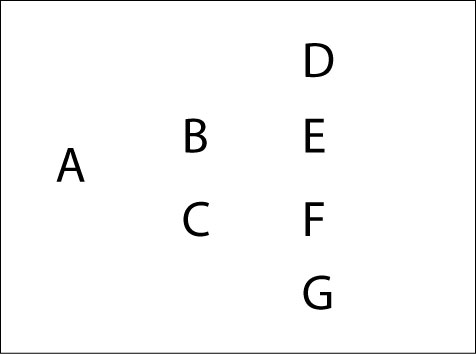
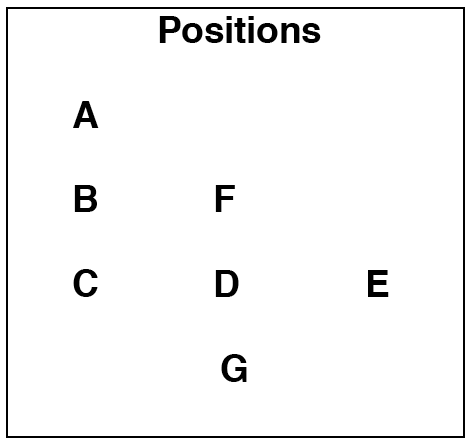
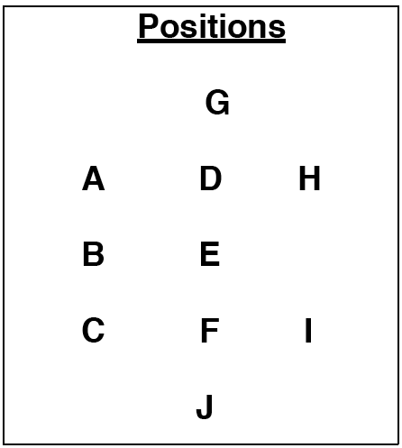
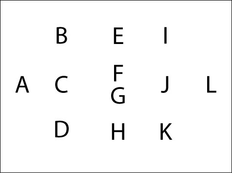
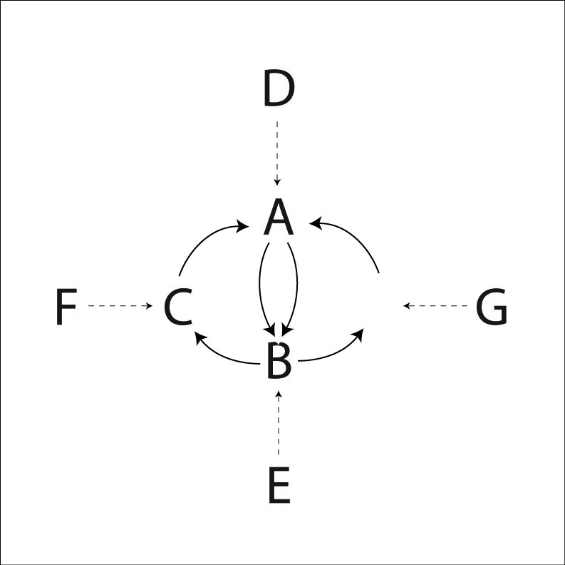
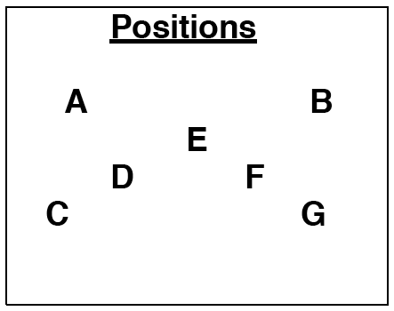
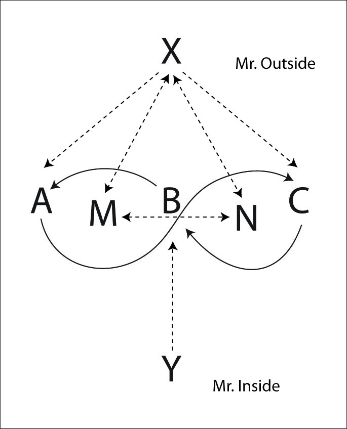

1.  7 Person Patterns
    =================

    1.  ### 1-2-4 Apollo (for Seven Jugglers)

|             |         |         |         |         |
|-------------|---------|---------|---------|---------|
| **Juggler** | **1**   | **2**   | **3**   | **4**   |
| **A**       | D       |         | G       |         |
| **B**       | F       | E       | D       | E       |
| **C**       | G       | F       | E       | F       |
| **D**       | A       |         | B       |         |
| **E**       |         | B       | C       | B       |
| **F**       | B       | C       |         | C       |
| **G**       | C       |         | A       |         |

Right hand counting

A throws long passes in 4-count to the outside edges (D and G)

B and C do sweep feeds of 3 feedees each.

D and G do 4-count between A and the feeder on their side (B and C respectively)

E and F do a sweep feed with a phantom (don't pass to the phantom).

Pattern by MAJ.

###

Easy patterns for lots of people

|             |         |         |         |         |
|-------------|---------|---------|---------|---------|
| **Juggler** | **1**   | **2**   | **3**   | **4**   |
| **A**       | F       |         |         |         |
| **B**       |         | F       |         | F       |
| **C**       | G       |         | F       |         |
| **D**       |         | G       |         | G       |
| **E**       |         |         | G       |         |
| **F**       | A       | B       | C       | B       |
| **G**       | C       | D       | E       | D       |

Right hand counting (or whatever count you want)

1.  C is the Hinge, and F and G are feeders.

    A Hinge is a juggler who passes to two feeders.

    The feeders in a Hinge pattern do a standard feed to 3 jugglers.

|             |         |         |         |         |
|-------------|---------|---------|---------|---------|
| **Juggler** | **1**   | **2**   | **3**   | **4**   |
| **A**       | E       |         | G       |         |
| **B**       |         | E       |         | E       |
| **C**       | J       |         | E       |         |
| **D**       |         | G       |         | G       |
| **E**       | A       | B       | C       | B       |
| **F**       |         | J       |         | J       |
| **G**       | H       | D       | A       | D       |
| **H**       | G       |         |         |         |
| **I**       |         |         | J       |         |
| **J**       | C       | F       | I       | F       |

Right hand counting (or whatever count you want)

Hinges: A, C

Feeders: E, G, J

|             |         |         |         |         |
|-------------|---------|---------|---------|---------|
| **Juggler** | **1**   | **2**   | **3**   | **4**   |
| **A**       | B       | C       | D       | C       |
| **B**       | A       |         | F       |         |
| **C**       |         | A       |         | A       |
| **D**       | G       |         | A       |         |
| **E**       |         | F       |         | F       |
| **F**       | I       | E       | B       | E       |
| **G**       | D       | H       | K       | H       |
| **H**       |         | G       |         | G       |
| **I**       | F       |         | L       |         |
| **J**       |         | L       |         | L       |
| **K**       | L       |         | G       |         |
| **L**       | K       | J       | I       | J       |

Right hand counting (or whatever count you want)

Hinges: B, D, I, K

Feeders: A, F, G, L

Hinges are great patterns for large numbers of jugglers, but admittedly, that can be rather boring for more advanced passers. One solution is the Precious Metal Hinge.

**Precious Metal Hinge**

Any line of three can be escalated by adding one or more clubs to the feed. For example, in the 12 person hinge above, A can feed an extra club feed with doubles. In this case:

A – Feeds B, C and D in standard 7 club extra club 2-count doubles feed.

B – Hinge, throws doubles to A and singles to F in 4-count.

D – Hinge throws doubles to A and singles to G in 4-count.

C – Throws doubles to A in 4-count.

That's a Golden Hinge. To start have B start with 4 clubs and A start with a left self).

For a Platinum Hinge, A throws triples and adds 2 clubs. B, C and D throw triple straight passes to A. B starts with a triple to A and A starts with a triple to C. C does a self.

For a Diamond Hinge (diamonds aren't actually a precious metal, I know), there are 4 extra clubs in the line. A throws all triple right hand passes and B, C and D throw triple right hand selves except when they throw triples to A or singles to the other feeder.

You can mix and match precious metals on any side of the hinge, although care must be taken to keep the timing synchronized.

Hinge created by Mike Newton.

### The Blast

This pattern became an instant Madison classic. Although the basic pattern is straight forward, there are a vast array of extensions and variations that can easily be tuned for the skill levels and number of available jugglers.

The weavers move in 8-count in the middle and 12-count on the ends. It's not difficult, but certainly not as boring as 8-count and 12-count might seem at first glance.

Dotted lines are passes and solid lines are movement.

|             |       |       |       |       |       |       |       |       |       |        |
|-------------|-------|-------|-------|-------|-------|-------|-------|-------|-------|--------|
| **Juggler** | **1** | **2** | **3** | **4** | **5** | **6** | **7** | **8** | **9** | **10** |
| **A**       | D     | E     | C     | G     | E     | F     | G     | D     | F     | C      |
| **B**       | F     | G     | D     | F     | C     | D     | E     | C     | G     | E      |
| **C**       |       |       | A     |       | B     |       |       | B     |       | A      |
| **D**       | A     |       | B     |       |       | B     |       | A     |       |        |
| **E**       |       | A     |       |       | A     |       | B     |       |       | B      |
| **F**       | B     |       |       | B     |       | A     |       |       | A     |        |
| **G**       |       | B     |       | A     |       |       | A     |       | B     |        |

Try the pattern in chocolate bar, or do a pirouette underneath a self triple while doing 12-count on the ends. See other variations in Fully Loaded Blast underneath Big Patterns, including some very challenging and fun extensions.

This pattern was created by Peter Kaseman and was inspired by a bouncing ball pattern.

### Twister 5

|             |       |       |       |       |       |       |       |       |       |        |
|-------------|-------|-------|-------|-------|-------|-------|-------|-------|-------|--------|
| **Juggler** | **1** | **2** | **3** | **4** | **5** | **6** | **7** | **8** | **9** | **10** |
| **X**       | A     |       | C     |       | E     |       | B     |       | D     |        |
| **Y**       |       | B     |       | D     |       | A     |       | C     |       | E      |
| **A**       | X     |       |       |       |       | Y     |       |       |       |        |
| **B**       |       | Y     |       |       |       |       | X     |       |       |        |
| **C**       |       |       | X     |       |       |       |       | Y     |       |        |
| **D**       |       |       |       | Y     |       |       |       |       | X     |        |
| **E**       |       |       |       |       | X     |       |       |       |       | Y      |

Right hand counting (or whatever count you want)

**Double Time Twister 5**

The feeders pass twice in a row to each feeder.

**Twister 5 Plus**

Add an extra club over the top with X and Y passing 7 club 4-count on their self throws.

**Twister 5 7/8-Count**

The feeders throw 3-count and the weavers pass 7 count on one leg, and 8 count on the other.

**Twister 5 5-Count**

X throws 2-count right handed. Y throws 2-count left handed. The weavers do 5-count. Fun!

**Twister 5 Sandwich**

Like the Twister Sandwich in 9 Person Patterns, you can replace one or both of the feeders with a 3 person weave (or any other weave, really). To make it more interesting, try a double time weave where each weaver passes twice to the other weave.

Pattern by MAJ.

###

This amazing pattern is another crown jewel of the MAJ pattern repertoire. It's a combination of Twister Plus and Double Time Twister.

The feeders are all doing Twister Plus, alternating triples all the way across the pattern with singles to the weavers. The weavers are doing a Double Time Twister Weave and pass twice on each side, once to each feeder. Messrs Outside pass to the outsides, and Messrs Inside pass to the inside weaver position.

|             |       |       |       |       |       |       |       |       |       |        |        |        |
|-------------|-------|-------|-------|-------|-------|-------|-------|-------|-------|--------|--------|--------|
| **Juggler** | **1** | **2** | **3** | **4** | **5** | **6** | **7** | **8** | **9** | **10** | **11** | **12** |
| **W**       | A     | T-X   | C     | T-X   | B     | T-X   | A     | T-X   | C     | T-X    | B      | T-X    |
| **X**       | T-W   | B     | T-W   | A     | T-W   | C     | T-W   | B     | T-W   | A      | T-W    | C      |
| **Y**       | T-Z   | A     | T-Z   | C     | T-Z   | B     | T-Z   | A     | T-Z   | C      | T-Z    | B      |
| **Z**       | C     | T-Y   | B     | T-Y   | A     | T-Y   | C     | T-Y   | B     | T-Y    | A      | T-Y    |
| **A**       | W     | Y     |       | X     | Z     |       | W     | Y     |       | X      | Z      |        |
| **B**       |       | X     | Z     |       | W     | Y     |       | X     | Z     |        | W      | Y      |
| **C**       | Z     |       | W     | Y     |       | X     | Z     |       | W     | Y      |        | X      |

Right hand counting

X and Y start with 4 clubs

Pattern by MAJ.

### Iron Cross Weave

|             |       |       |       |       |       |       |       |       |       |        |        |        |
|-------------|-------|-------|-------|-------|-------|-------|-------|-------|-------|--------|--------|--------|
| **Juggler** | **1** | **2** | **3** | **4** | **5** | **6** | **7** | **8** | **9** | **10** | **11** | **12** |
| **A**       | D     |       | E     |       | F     |       | D     |       | E     |        | G      |        |
| **B**       | E     |       | G     |       | D     |       | E     |       | F     |        | D      |        |
| **C**       | F     |       | D     |       | E     |       | G     |       | D     |        | E      |        |
| **D**       | A     |       | C     |       | B     |       | A     |       | C     |        | B      |        |
| **E**       | B     |       | A     |       | C     |       | B     |       | A     |        | C      |        |
| **F**       | C     |       |       |       | A     |       |       |       | B     |        |        |        |
| **G**       |       |       | B     |       |       |       | C     |       |       |        | A      |        |

Right hand counting

See all those selves? Once you're comfortable with this pattern, make life more interesting by adding extra passes in the selves. One variation is for F and G to pick up the passes before and after their normal passes (so they throw pass, pass, pass, self). Another variation is for each E, F and G to all pass twice in a row to the weavers. D can't pass twice in a row without making the turn from D to E rather difficult.

Pattern by Luke Emery.

###

A and B are feeding a standard weave with one position common to both. The weavers do a standard weave until they get between A and B. The weaver then leaves one weave to enter the other. During this transition, the weaver makes 2 passes in a row.

|             |       |       |       |       |       |       |       |       |       |        |        |        |        |        |        |        |        |        |        |        |
|-------------|-------|-------|-------|-------|-------|-------|-------|-------|-------|--------|--------|--------|--------|--------|--------|--------|--------|--------|--------|--------|
| **Juggler** | **1** | **2** | **3** | **4** | **5** | **6** | **7** | **8** | **9** | **10** | **11** | **12** | **13** | **14** | **15** | **16** | **17** | **18** | **19** | **20** |
| **A**       | C     | D     | F     | C     | D     | F     | G     | D     | F     | G      | E      | F      | G      | E      | C      | G      | E      | C      | D      | E      |
| **B**       | E     | F     | G     | E     | C     | G     | E     | C     | D     | E      | C      | D      | F      | C      | D      | F      | G      | D      | F      | G      |
| **C**       | A     |       |       | A     | B     |       |       | B     |       |        | B      |        |        | B      | A      |        |        | A      |        |        |
| **D**       |       | A     |       |       | A     |       |       | A     | B     |        |        | B      |        |        | B      |        |        | B      | A      |        |
| **E**       | B     |       |       | B     |       |       | B     |       |       | B      | A      |        |        | A      |        |        | A      |        |        | A      |
| **F**       |       | B     | A     |       |       | A     |       |       | A     |        |        | A      | B      |        |        | B      |        |        | B      |        |
| **G**       |       |       | B     |       |       | B     | A     |       |       | A      |        |        | A      |        |        | A      | B      |        |        | B      |

Right hand counting

A and B are feeding a standard weave with one position common to both. The weavers do a standard weave until they get between A and B. The weaver then leaves one weave to enter the other. During this transition, the weaver makes 2 passes in a row.

Pattern by Steve Otteson.

### Eye of the Needle

A Twister Weave has lots of time and space in the middle.

If your weavers are quite comfortable with outside turns in a Twister Weave, then here is a fun and good looking pattern. This is just a Twister Weave with another passing duo embedded in the center.

|             |       |       |       |       |       |       |       |       |       |        |        |        |
|-------------|-------|-------|-------|-------|-------|-------|-------|-------|-------|--------|--------|--------|
| **Juggler** | **1** | **2** | **3** | **4** | **5** | **6** | **7** | **8** | **9** | **10** | **11** | **12** |
| **X**       | A     | N     | C     | M     | B     | N     | A     | M     | C     | N      | B      | M      |
| **Y**       |       | B     |       | A     |       | C     |       | B     |       | A      |        | C      |
| **A**       | X     |       |       | Y     |       |       | X     |       |       | Y      |        |        |
| **B**       |       | X     |       |       | Y     |       |       | X     |       |        | Y      |        |
| **C**       |       |       | X     |       |       | Y     |       |       | X     |        |        | Y      |
| **M**       | N     |       | N     | X     | N     |       | N     | X     | N     |        | N      | X      |
| **N**       | M     | X     | M     |       | M     | X     | M     |       | M     | X      | M      |        |

Right hand counting

If this pattern is too challenging as written, then start by skipping the passes from M and N to X. Then M and N just do a 4-count in the middle and X does a standard Mr. Outside 4-count.

There are a number of patterns that have enough room to embed other patterns in the middle.

Pattern by MAJ.
