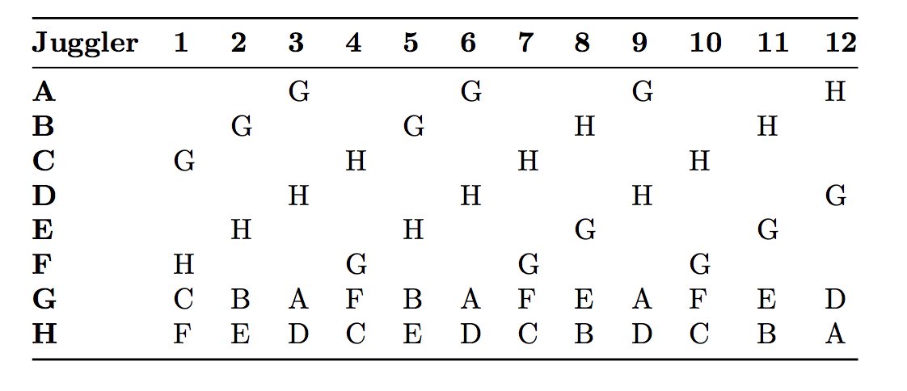
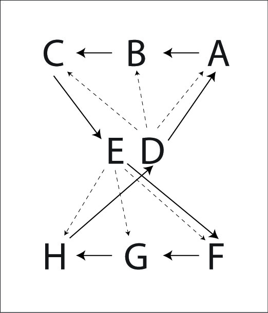
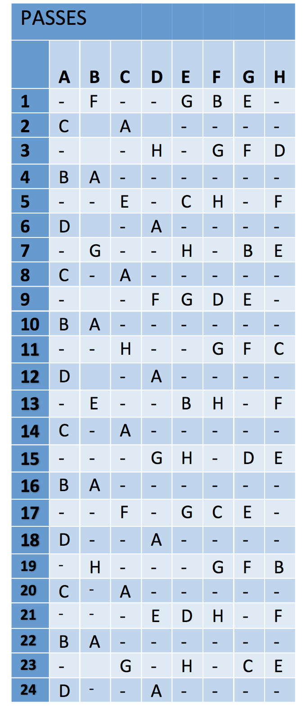
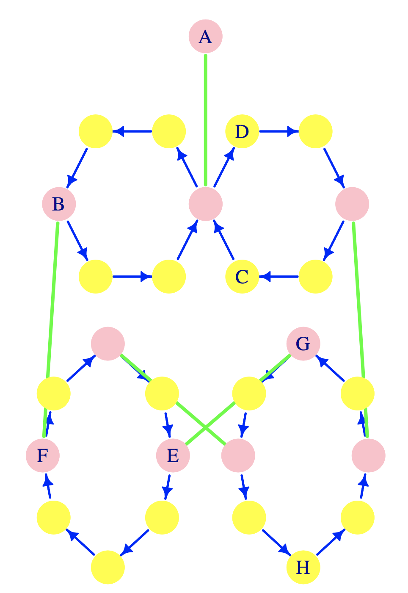
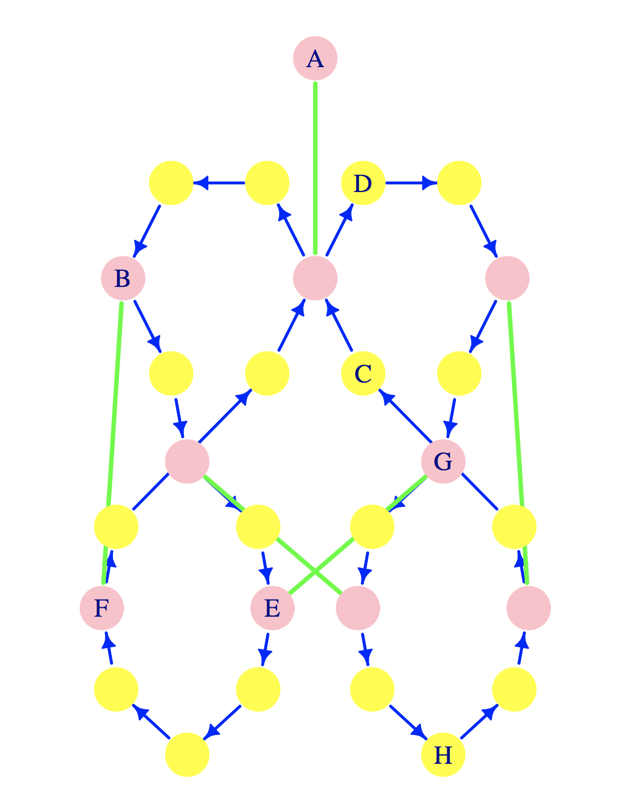
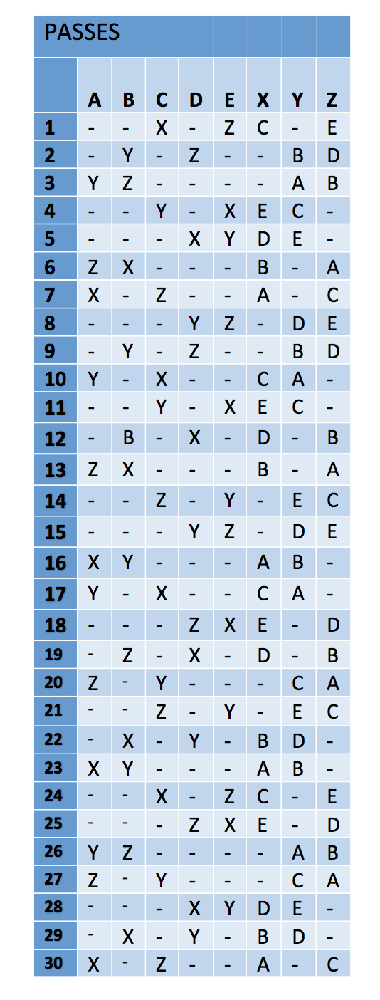
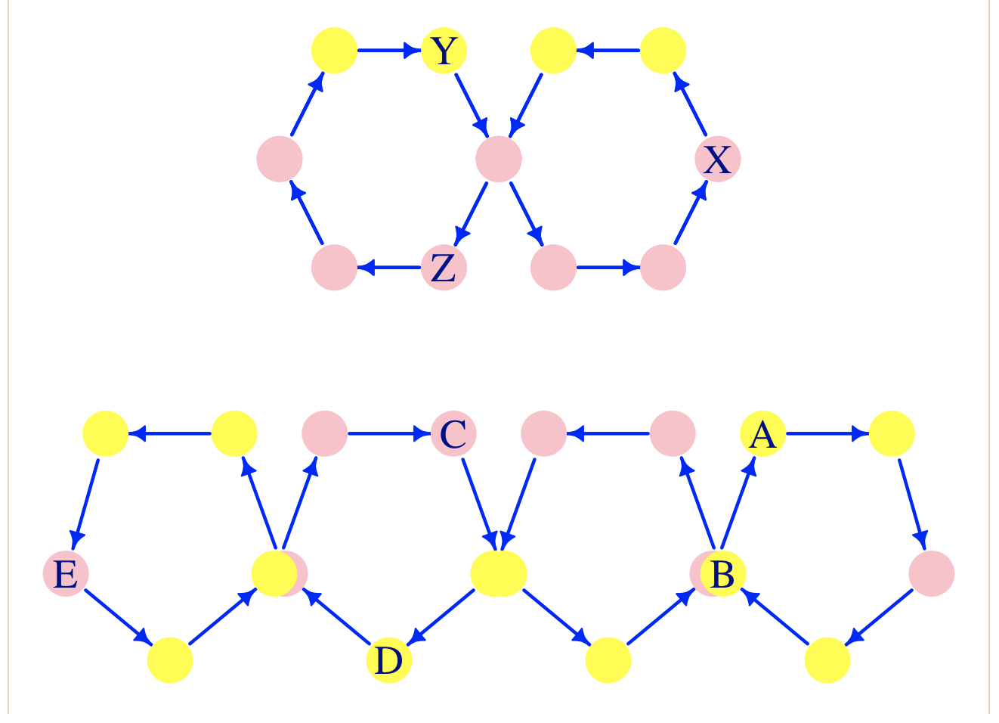

#  8 Person Patterns

## Feast
  
  Everyone feeds everyone else, on count of choice.

## 4-on-4 line

Feed the two people opposite you, or do a baby position on the end. Use only as
a warm-up!

## Double vision 4's

  Take any (almost any) 4 person pattern and turn each juggler into two.  Double-vision boxes are 
   nice and fun; The double-vision oogle boogie is possible too.  Someone should try a double-vision
   shooting star, but we haven't yet!

## Big Hinge minus 4

  Drop all 4 baby positions from this 12 person pattern.

## Polymer Weave

It's a passing axiom that any 2-count feeder can be replaced by a standard weave. If this
is applied to the traditional W pattern, the result is this crazy pattern. It is
called a Polymer Weave because you can add additional weaves to either end of
the pattern (just like adding additional passers to a W).

|                                        |                          |
|------------|------------|
| {width=45%} | {width=45%} |
| positions                                       |    Right-hand counting |

Pattern by Mike Newton.

## Benzene Rings (for 8 Jugglers)

### Original

Here's another MAJ standard. E and F are carriage return feeders, feeding to 3
positions: left, middle, right, left, middle, right, etc. The rest of the
jugglers move around in a ring, passing to the feeders. They pass 3 times to
each feeder and then turn around to pass 3 times to the next feeder.

|                                        |                          |
|------------|------------|
| {width=42%} | {width=50%} |
| positions                                       |    Right-hand counting |

The feeders G and H feed carriage return to 4 positions (instead of 3 positions
in the 6 juggler version). The movers move around the loop passing to each
feeder 4 times before turning around to pass to the other feeder. The graph
shows half of a full cycle. The pattern will repeat in its mirror image.

Pattern by Mike Newton and MAJ.

**Variation:**  

### Inverted Extra Club Benzene Ring. 

A very cool variation of the Benzene Ring is to invert the movers, so they are all facing
 inward instead of outward on the elliptical path.   They can't pass to the same feeder (unless by back drop),
so they pass doubles over the opposing line and toward the opposite-side feeder.   So it's a two-extra
club pattern: double-throw then shift over on 6-count, repeat for four spots, then turn 180 and repeat. Careful about collisions!  Usually feeders start with the extra clubs.
  To make it more fun the movers can do 3-count, by adding a single pass to their counterpart inside the ellipse!
These are are lefts that are themselves 6 count; so together the movers do 3-count, alternating single inside pass double pass over the line.

## Khaos Butterfly
{width=40%}

 Kat's Khaos Butterfly is two standard feeds back to back. After each sweep of
the feed, each juggler moves to the next position.

Solid lines are movement, dotted lines are passes.

| **Juggler** | **1** | **2** | **3** | **4** | **5** | **6** | **7** | **8** | **9** | **10** | **11** | **12** | **13** | **14** | **15** | **16** |
|-------------|-------|-------|-------|-------|-------|-------|-------|-------|-------|--------|--------|--------|--------|--------|--------|--------|
| **A**       |       |       |       | D     | H     |       | H     |       |       | G      |        |        | C      | E      | C      | B      |
| **B**       | D     |       | D     |       |       | H     |       |       | E     | F      | E      | C      |        |        |        | A      |
| **C**       |       | D     |       |       | F     | G     | F     | E     |       |        |        | B      | A      |        | A      |        |
| **D**       | B     | C     | B     | A     |       |       |       | H     | G     |        | G      |        |        | F      |        |        |
| **E**       | G     | H     | G     | F     |       |       |       | C     | B     |        | B      |        |        | A      |        |        |
| **F**       |       |       |       | E     | C     |       | C     |       |       | B      |        |        | H      | D      | H      | G      |
| **G**       | E     |       | E     |       |       | C     |       |       | D     | A      | D      | H      |        |        |        | F      |
| **H**       |       | E     |       |       | A     | B     | A     | D     |       |        |        | G      | F      |        | F      |        |

> * Right hand counting

Pattern by Kat Girdaukas.

## Egg Beater Twister

### Original

We tried to replace the 4-count handle of a standard Egg Beater with a Twister Weave minus one feeder. 
 Having to resolve some line problems we got the following, which is pretty fun. Juggler 
A is a Mr. Inside feeder of twister weavers B, C, D, each on 6-count.  Jugglers E, F
and G, H form two beaters in an Egg Beater.  They each do 4-count, 4-count, 8-count,
with that deep pass going up to the Weave, in place of any Mr. Outside.  Pink nodes
show passing positions; yellow nodes are self-positions;  blue edges show 2-count
 transitions.  Green edges indicate where passes go.  Letters in the graph show starting 
positions of the 8 jugglers

|                                        |                          |
|------------|------------|
| {width=40%} | {width=50%} |
| positions                                       |    Right-hand counting |

### Everyone Moves

Like above, but after your Mr. Outside pass in the weave you move into the Egg Beater;
and after your Egg Beater loop you head back into the center of the Weave.   As the
figure below shows, this slightly modifies the previous graph by redirecting
 4 blue edges. It takes
folks who are good at twisters and egg-beaters, but we did it at 2017 Madfest  if memory serves.

 {width=50%} 

## 3-5 Foie Graham

This is  really fun pattern for 8 good weavers.

Refer to the video from Nov 30, 2017,  [MAJ](https://photos.app.goo.gl/fajhq73DfffTtDfm1),
in which A=Mark, B=Conner, C=Mel, D=Jeff, E=Chan, X=Graham, Y=Mike, Z=Peter.  As the table below indicates, passers A-E do 4 of 10 rights; passers X-Z do 4 of 6 rights.   The figure below shows all positions in the pattern (nodes) and 1-beat transitions (blue edges); the starting configuration is also shown; pink nodes indicate passing positions and yellow are self beats. Two pairs pass on every right-hand beat (e.g., starting Z-E and X-C).  In the steady state A-E each do pass-pass-self-self-pass-self-self-pass-self-self; X-Z do pass-pass-pass-pass-self-self; all right-hand counting.   Not counting selves, it’s also neat that each of A-E pass in sequence to X, Y, then Z; never in another order. There’s also a curious letter shuffling going on from the perspective of X,Y, and Z.  Of all possible ordered sets of 4 from 5, only 5 appear as the passing sequences of X, Y, and Z. And they do them in the same order, but out-of-phase: EDBA-CEDB-ACED-BACE-DBAC, thanks to the dynamics of the two weaves.   It’s interesting that to go from one to the next you append the non-passed-to juggler (prefix) to the first-three of four (suffix).  E.g. EDBA goes to CEDB.   Passing repeats after 30 right-hand beats (see table), but a full cycle is 60 right-hand beats to get back into the starting places! Notice also there are 20 positions in the 5-weave (5 positions on each of 4 loops), which makes it a slightly faster loop than a typical weave (which has 6 positions per loop and 3 loops).

|                                        |                          |
|------------|------------|
| {width=30%} | {width=70%} |
| positions                                       |    Right-hand counting |

 Pattern by Melonhead

 **Variations:**  We've done two 7-person variations; in both the 5-weave is 
 retained but the 3-weave is replaced by two 2-count feeders.   In one the
 feeders are on the same side; the other is Twister style.   To avoid a collision
  in the Twister, the feeders need to swap one of their throws on each cycle.

## Two Mating Three Leaf Clovers

Refer to the 4-person Three Leaf Clover (standard).   Make two copies that overlap
along one leaf, and start out juggling within clover as normal. But whenever you
enter the special leaf you transition into the other clover.  
