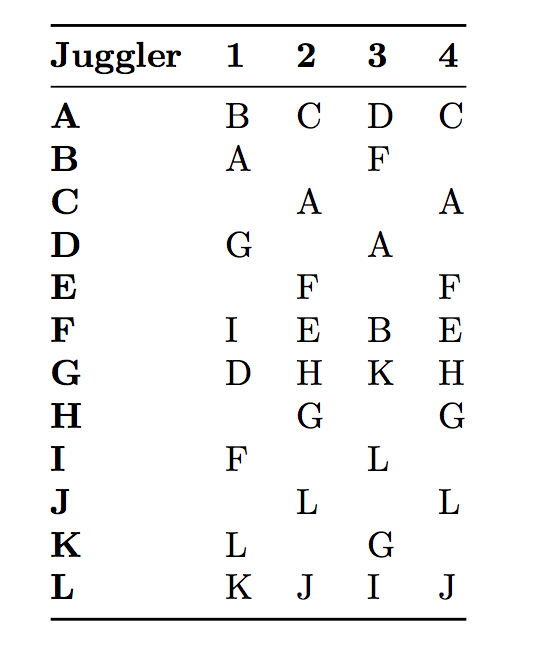
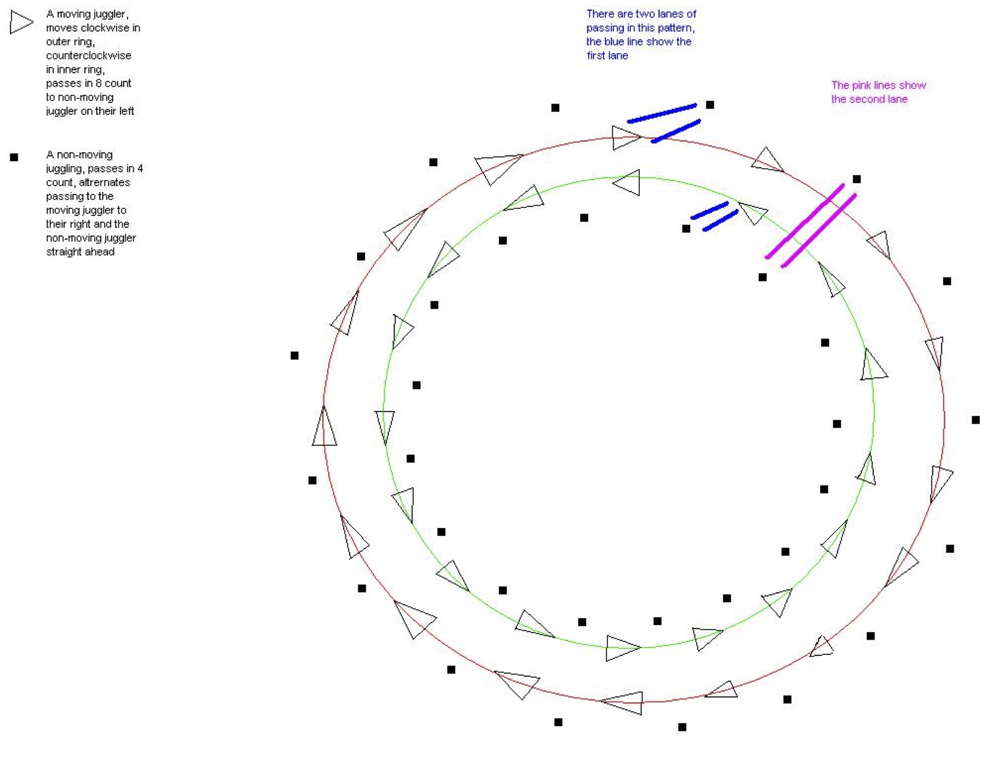

# Big Patterns

So the big problem with big patterns is to get enough interested jugglers who are
like-minded and sufficiently skilled to pull off something cool.   Mathematically
there are many more possible juggling patterns for lots of people, but in fact most of 
them are not realistic, thanks to the big problem.   We have been fortunate to overcome
this problem in a few cases, summarized here.

## Big Hinge

This one was an early big pattern, possibly done first in the Great Hall.  Each side
of a square is a line of 3 feedees.  The feeders alternate being inside or outside of
the square.  The 4 corners (hinges) each participate in two lines.

|                                        |                          |
|------------|------------|
| {width=45%} | {width=40%} |
| positions                                       |    Right-hand counting |

**Hinges:** B, D, I, K
**Feeders:** A, F, G, L

Hinges are great patterns for large numbers of jugglers, but admittedly, that
can be rather boring for more advanced passers. One solution is the Precious
Metal Hinge.

## Precious Metal Hinge

Any line of three can be escalated by adding one or more clubs to the feed. For
example, in the 12 person hinge above, A can feed an extra club feed with
doubles. In this case:

* **A** – Feeds B, C and D in standard 7 club extra club 2-count doubles feed.
* **B** – Hinge, throws doubles to A and singles to F in 4-count.
* **D** – Hinge throws doubles to A and singles to G in 4-count.
* **C** – Throws doubles to A in 4-count.

That's a Golden Hinge. To start have B start with 4 clubs and A start with a
left self).

For a Platinum Hinge, A throws triples and adds 2 clubs. B, C and D throw triple
straight passes to A. B starts with a triple to A and A starts with a triple to
C. C does a self.

For a Diamond Hinge (diamonds aren't actually a precious metal, I know), there
are 4 extra clubs in the line. A throws all triple right hand passes and B, C
and D throw triple right hand selves except when they throw triples to A or
singles to the other feeder.

You can mix and match precious metals on any side of the hinge, although care
must be taken to keep the timing synchronized.

## Double Vision Hex

 See 6-person Hex and make each juggler two! Still a dream, but maybe not for long.

## Fully Loaded Blast

 The Blast has a lot of fun and challenging variations. Here's a Blast loaded
up with extra passes and twister weaving for 11 people, but the basic concept
works for 7 through 12 people.

The movers (G, H, I, J, and K) move in a typical Blast fashion, except they turn
around after every pass to A and B to pass to feeders behind the weave.

The table shows ½ of a full cycle, so the table ends in the mirror image of the
start.

| **Juggler** | **1** | **2** | **3** | **4** | **5** | **6** | **7** | **8** | **9** | **10** |
|-------------|-------|-------|-------|-------|-------|-------|-------|-------|-------|--------|
| **A**       | H     |       | I     |       | G     |       | K     |       | I     |        |
| **B**       | J     |       | K     |       | H     |       | J     |       | G     |        |
| **C**       | G     |       | G     |       | I     |       | I     |       | K     |        |
| **D**       | I     |       | H     |       | K     |       | G     |       | J     |        |
| **E**       | K     |       | J     |       | J     |       | H     |       | H     |        |
| **F**       |       | G     |       | J     |       | I     |       | H     |       | K      |
| **G**       | C     | F     | C     |       | A     |       | D     |       | B     |        |
| **H**       | A     |       | D     |       | B     |       | E     | F     | E     |        |
| **I**       | D     |       | A     |       | C     | F     | C     |       | A     |        |
| **J**       | B     |       | E     | F     | E     |       | B     |       | D     |        |
| **K**       | E     |       | B     |       | D     |       | A     |       | C     | F      |

> * Right-hand counting.

{width=50%}

For more variations, replace D and F with a weave or with a single feeder. You
can also remove either of the outside feeders C and E for fewer people (and an
easier pattern).

Replacing D and F with a weave is called the Blast Toupee (because there is a
weave on top).

Pattern by Peter Kaseman and MAJ.

## Double-Decker Sandwich

A sandwich with two middle layers. In stacking speak, it's a 3-3-3-3: weave; double-time twister; double-time twister; weave.

Pattern by MAJ.

## Triangle Weave

The Triangle Weave for 15 jugglers consists of 3 standard weaves (9 jugglers)
and 6 feeders in 4-count. There is a Mr. Inside feeder for each weave, and then
a Mr. Outside feeder in between the weaves who passes in turn to each adjacent
weave.

{width=50%} 

| **Juggler** | **1** | **2** | **3** | **4** | **5** | **6** | **7** | **8** | **9** | **10** | **11** | **12** |
|-------------|-------|-------|-------|-------|-------|-------|-------|-------|-------|--------|--------|--------|
| **A**       | L     |       |       | K     |       |       | J     |       |       | K      |        |        |
| **B**       |       | K     |       |       | L     |       |       | K     |       |        | J      |        |
| **C**       |       |       | J     |       |       | K     |       |       | L     |        |        | K      |
| **D**       |       |       | L     |       |       | M     |       |       | N     |        |        | M      |
| **E**       |       | M     |       |       | N     |       |       | M     |       |        | L      |        |
| **F**       | N     |       |       | M     |       |       | L     |       |       | M      |        |        |
| **G**       |       |       | N     |       |       | O     |       |       | J     |        |        | O      |
| **H**       |       | O     |       |       | J     |       |       | O     |       |        | N      |        |
| **I**       | J     |       |       | O     |       |       | N     |       |       | O      |        |        |
| **J**       | I     |       | C     |       | H     |       | A     |       | G     |        | B      |        |
| **K**       |       | B     |       | A     |       | C     |       | B     |       | A      |        | C      |
| **L**       | A     |       | D     |       | B     |       | F     |       | C     |        | L      |        |
| **M**       |       | E     |       | F     |       | D     |       | E     |       | F      |        | D      |
| **N**       | F     |       | G     |       | E     |       | I     |       | D     |        | H      |        |
| **O**       |       | H     |       | I     |       | G     |       | H     |       | I      |        | G      |

> * Right-hand counting.

To start, all the Mr. Outside feeders pass to their right, and then feed
alternately left and right in 4-count. The Mr. Inside feeders start on beat 2
and pass 4-count to their weave. The weavers pass to alternate Mr. Outside
feeders on either end and the Mr. Inside feeder in the middle.

There are all the usual variations of different weave counts, chocolate bars,
left handed etc. The pattern design can be any polygon where the side is a weave
with a Mr. Inside feeder and the vertices of the polygon are a Mr. Outside
feeder who alternates passing between weaves (also known as Doc Blanchard and Glenn Davis). 
See also the Octagon Weave. The
number of jugglers is 5N were N is the number of sides of the polygon (three for
each weave plus 2 feeders).

Pattern by Mike Newton and Luke Emery.

## Octagon Weave

Similar to the Triangle Weave, except with 8 sides and 48 jugglers. This was
the big pattern at 2007 Madfest.

{width=80%}

{width=80%}

Pattern by Mike Newton.

## Big Circle 

Pattern by Graham Paasch.  Juggled at 2013 Madfest. [Thanks Casey Rentmeester](https://youtu.be/hfRiGC7_NSU)

 {width=100%}

## Mating Clovers

There are lots of interesting options by mating clovers and possibly adding orbiters.
Mel and a patient crew at Pass Out (2017) got a Box of Four Leaf Clovers working for 20 jugglers, 
We've practiced a mate pair of 4 leaf clovers with 2 orbiters (12). Orbiters stay in their clovers; others move between clovers. The standard configuration has one juggler per isolated leaf; two jugglers per overlapping leaf, and one in the middle of each clover.  

*two mating 4-leaf clover pics*

**CHECK**Line up the start so that those sharing a leaf are counterparts in the two neighboring clovers.  Melonhead gave us the first mating clovers.

A magnificent expression of mating clovers is the hex-of-clovers, which we did as the <i> big pattern </i> at both Madfest 2018 and Madfest 2019. It's a ring (in fact a hex) of 7 connected three-leaf clovers, for 24 jugglers!
