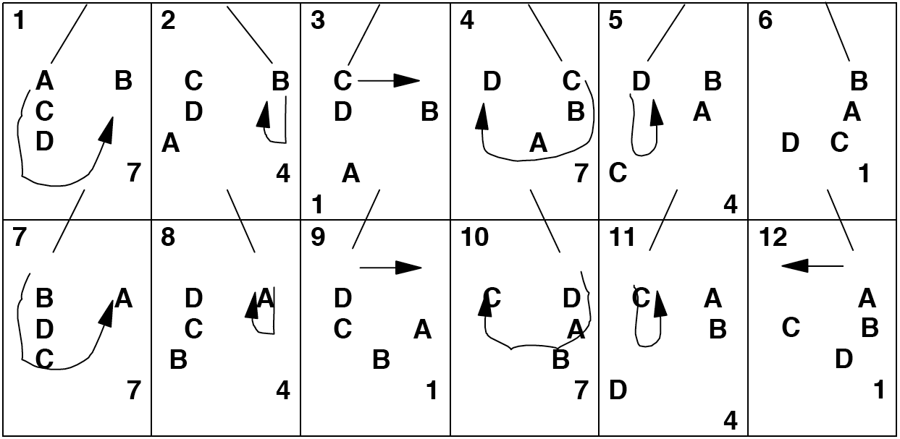

## Gandini Siteswap Weaves

Site-swap is a way to use numbers to determine how high an object is thrown in a pattern, and determines which hand the object lands in. At the IJA festival in Niagara Falls, Sean Gandini showed us that jugglers could weave in a site-swap pattern while being fed passes by a feeder.

Take any valid site-swap string, 741, for example, and find the average: 7 + 4 + 1 = 12, 12/3 = 4. The average of the site-swap string is the number of weavers needed for the pattern. Add one more juggler to feed the weavers and we are ready to go.

The feeder will alternately feed passes to 2 positions. The site-swap numbers will guarantee that only one weaver will be in a feeding spot when it is time to feed that spot a pass. Arrange the weavers so that the start will work. See the example below to see how this is done.

Have the feeder assign the site-swap numbers at the same time that the passes are made, repeating the numbers as they go. When a weaver receives a pass he or she will also receive a number. The number, minus one, is the number of self throws that the weaver will perform before he or she will make the next pass to the feeder. If the given number is even, then the weaver will get his or her next pass at the same feeding spot where the last pass was received. If the given number is odd, then the weaver has to cross over to the other feeding spot for the next pass.

The glossary will show how to test for a valid site-swap.

To save space, the feeder is not pictured in the following example.

**741 Site-Swap Weave **

Lines indicate passes, arrows indicate movement.

{width=80%}

This idea can be extended in many different ways. For example, the weavers and feeders can do patterns like Burke's Barrage or Mill's Mess. A double weave can be any two siteswap weaves passing to each other. For example, try a regular Gandini Weave (333) against a 441 Gandini Weave or a 534 Gandini weave, etc.
